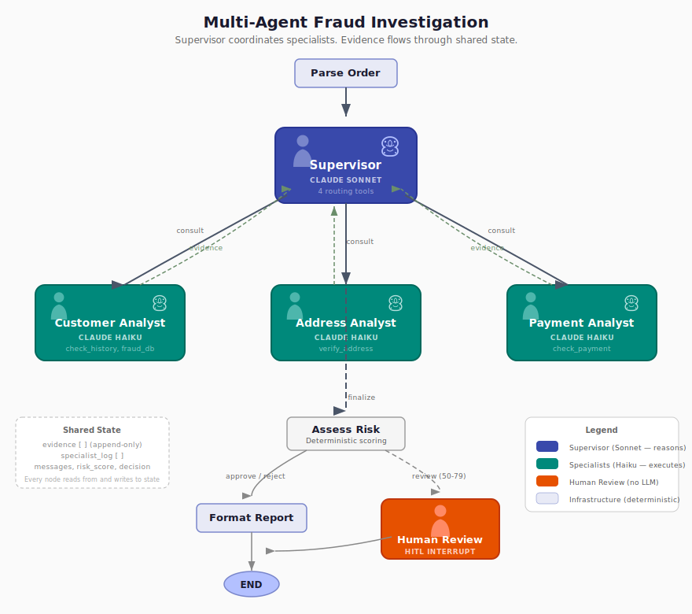

# LangGraph Fraud Investigation Tutorial

This tutorial walks you through detecting fraud starting from a simple function-to-LLM call, progressively adding LangGraph scaffolding, tools, investigation loops, infrastructure, human-in-the-loop workflows, and multi-agent coordination — all using the same 6 fraud cases so you can see exactly what each addition contributes. By the end, you'll be able to determine whether LangGraph — and which parts of LangGraph — are necessary for your own scenarios.

This is what you'll build:



A supervisor agent coordinates three specialist agents. Each investigates a different domain — customer history, shipping addresses, payment patterns. Evidence accumulates in shared state. A deterministic scoring function produces auditable risk scores. Ambiguous cases pause for human review.

## Why Fraud Investigation

Fraud investigation demands high auditability — every decision needs a trail. This plays to LangGraph's strengths: checkpointed state, human-in-the-loop interrupts, structured evidence accumulation, and inspectable graph execution. This is a LangGraph tutorial wearing a fraud costume — not the other way around. Every feature teaches a LangGraph concept. The fraud logic is believable but minimal.

## The 6 Test Cases

The same 6 cases run through every phase. The cases are the constant; the architecture is the variable.

| Case | Scenario | Challenge |
|------|----------|-----------|
| 1: Obviously Legit | 5-year customer, 50 orders, $45 purchase | Baseline — should approve quickly |
| 2: Mildly Suspicious | New customer, no history, $380 order | New but not fraudulent — shouldn't overreact |
| 3: High Risk | Disposable email, freight forwarder, $2,800 | Multiple red flags — should reject |
| 4: Conflicting Signals | Loyal customer, warehouse address, IP change | The hard one — conflicting signals need investigation |
| 5: Historical Fraud | Prior fraud flag (resolved), normal $60 order | Should recognize the flag was a false positive |
| 6: Tool Error | Normal order, payment service unavailable | Should handle gracefully, not crash |

Case 4 is the real test. A loyal 2-year customer with 30 successful orders, but the shipping address is a warehouse shared by 3 accounts, there's a recent IP change, and a slight name mismatch. Phase 1 scores it 5/100 (approve) because the LLM can't see the warehouse. Phase 3 scores it 61/100 (review) because tools surface the conflicting signals and deterministic scoring balances them.

## The Phases

Each phase builds on the previous one, adding one or two concepts at a time.

### [Phase 0: The Baseline](phases/phase0-baseline/GUIDE.md)
A plain Python function calls the LLM. No graph, no tools. Establishes what a single API call can and can't do. Case 4 fails badly — the LLM guesses from surface data.

### [Phase 1: First Graph](phases/phase1-first-graph/GUIDE.md)
Same logic, now in a LangGraph state machine. Teaches StateGraph, nodes, edges, and conditional edges. The graph doesn't improve results — it sets up the scaffolding Phase 2 needs.

### [Phase 2: The Loop](phases/phase2-tools/GUIDE.md)
Three investigation tools and the first cycle in the graph. The LLM can now call tools, observe results, and decide whether to investigate further or stop. This is the foundational shift from deterministic to dynamic execution — the LLM controls the flow.

### [Phase 3: The Investigator](phases/phase3-investigator/GUIDE.md)
The hinge of the tutorial. The LLM investigates, Python scores, LangGraph manages the loop. Structured evidence accumulates through the investigation. A deterministic scoring formula produces auditable risk scores. Every subsequent phase must match these scores — they're the baseline.

Score accuracy across the first three phases: Phase 1 gets 3/6 in range. Phase 2 adds tools and gets... 3/6. Different misses, same hit rate. More data didn't help because the LLM was still interpreting and scoring in prose. Phase 3 hits 6/6 by narrowing what the LLM is responsible for — not by giving it more to work with.

### [Phase 4: Infrastructure](phases/phase4-infrastructure/GUIDE.md)
Same graph, new capabilities inside it. Graph visualization, streaming, recursion limits, error handling, dead-end prevention, and token budget circuit breakers. The infrastructure you need once the LLM controls the flow.

### [Phase 5: Workflows + HITL](phases/phase5-workflows/GUIDE.md)
Checkpointing enables pause, resume, and fork. Ambiguous cases (score 50-79) route to human review. The graph pauses, persists state, and waits. Hours later, an analyst resumes with a decision. State forking enables "what-if" analysis.

### [Phase 6: Multi-Agent](phases/phase6-multi-agent/GUIDE.md)
The crown jewel. A Sonnet supervisor routes to three Haiku specialists. Even at 5 tools, decomposing complex reasoning from simple execution cuts costs by 67% — same decisions, same scores. At 200+ tools, you also get better tool selection. The duplicate evidence bug — the most instructive failure in the tutorial — emerges from how agents compose together.

### [Phase 7: Ship It](phases/phase7-ship-it/GUIDE.md)
This phase covers making a LangGraph app ready for production: schema hardening (TypedDict → Pydantic), context engineering (managing growing conversations), and an evaluation harness for non-deterministic systems. No new graph topology — this phase hardens everything built in Phases 1-6.


## The Story Arc

| Phases | Message |
|--------|---------|
| 0-1 | You don't need LangGraph yet |
| 2-3 | Now you do — the loop appears, the investigator emerges |
| 4 | Here's what you get — infrastructure for LLM-driven loops |
| 5 | Real workflow patterns — pause, resume, fork |
| 6 | Scale and specialize — multi-agent with cost optimization |
| 7 | Ship it — the other 70% |

## What Is LangGraph

LangGraph is a workflow system for LLMs — it coordinates their actions and provides plumbing to them, much like traditional workflow engines provide plumbing to applications.

LLMs bring reasoning to applications the same way they bring it to people — the application sends a prompt and receives an answer. But LLMs don't track state and don't remember what they did two calls ago. They can't execute code and can't enforce their own limits. LangGraph is the loop that keeps calling them back: accumulating state between calls, re-feeding context each time, executing the tools the LLM asks for, enforcing guardrails (recursion limits, token budgets), and handling pause/resume for human-in-the-loop.

LangGraph makes non-deterministic, meaning-based branching manageable — visualization, state accumulation, checkpointing, guardrails for decisions you can't predict at design time, and multi-agent coordination where specialized agents collaborate on complex tasks. What it does NOT optimize: token management, LLM call caching, or cost per call. The savings is developer time and plumbing, not runtime efficiency.

## When to Use LangGraph

**You need it when:**
- The LLM drives a loop — reason, act, observe, repeat
- You need to pause for human review and resume hours later
- You're coordinating multiple agents with different roles
- Workflows branch based on what the LLM discovers at runtime

**You don't when:**
- Single LLM call with a prompt
- Linear pipeline (prompt → LLM → parse → return)
- Basic RAG without agentic behavior

LangGraph is the right tool when you need durable, interruptible, multi-step agent workflows. For everything else, it is overhead.

## How to Run

Each phase runs independently:

```bash
python3 phases/phase0-baseline/graph.py
python3 phases/phase1-first-graph/graph.py
python3 phases/phase2-tools/graph.py
python3 phases/phase3-investigator/graph.py
python3 phases/phase4-infrastructure/graph.py
python3 phases/phase5-workflows/graph.py
python3 phases/phase6-multi-agent/graph.py
python3 phases/phase7-ship-it/graph.py
```

Requires an Anthropic API key in `.env`:

```
ANTHROPIC_API_KEY=your-key-here
```
