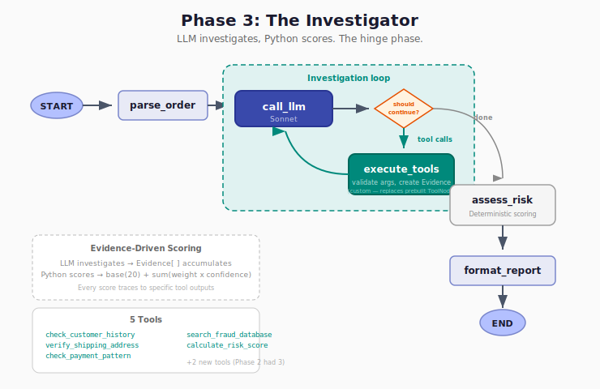

# Phase 3: The Investigator — Full ReAct Agent

## What This Phase Does

Phase 3 is the hinge of the entire tutorial. This is where LangGraph earns its keep.

Phase 2 added tools and the loop, but the LLM still scored risk itself — producing a number from its own reasoning, which isn't auditable. It also called all tools for every case regardless of what was relevant.

Phase 3 separates concerns: **the LLM investigates, Python scores, LangGraph manages the loop.** The agent decides what to check and when to stop. A deterministic scoring function calculates the risk from structured evidence. Every score traces back to specific tool outputs and explicit mapping rules.



## Architecture

```
START -> parse_order -> call_llm -> [should_continue]
                           ^         |-- has tool calls -> execute_tools -> call_llm (loop)
                           |         +-- investigation_complete -> assess_risk -> format_report -> END
                           +-----------------------------------------+
```

The loop is the same shape as Phase 2, but the nodes inside are custom — `execute_tools` replaces the prebuilt `ToolNode`, and `should_continue` checks an explicit termination flag instead of just looking for tool calls.

## What's New Since Phase 2

- **Two new tools** — `search_fraud_database` (cross-reference indicators) and `calculate_risk_score` (deterministic scoring). Total: 5 tools.
- **Structured evidence** — Every tool call produces an `Evidence` record: tool name, finding, risk signal, confidence, raw data, timestamp. Evidence accumulates via `operator.add` — each node appends, never overwrites.
- **Deterministic scoring** — `_calculate_risk_score_impl` uses weighted signals: `base(20) + sum(weight × confidence)`. The LLM never sets the score. It signals "I'm done" by calling `calculate_risk_score`, and the formula produces the number.
- **Custom execute_tools node** — Replaces Phase 2's prebuilt `ToolNode`. Intercepts tool calls to validate arguments (preventing LLM hallucination of addresses and amounts) and to route `calculate_risk_score` to the deterministic implementation.
- **Tool argument validation** — The LLM decides *which* tools to call, but the system ensures inputs are correct. During development, the LLM consistently fabricated addresses and amounts instead of using exact order values. The fix is structural: `execute_tools` overrides args with actual order data from state.

### Why Tool Execution Is a Node, Not Conditional Edges

Why not make each tool a separate node with conditional edges routing to them? Because the LLM can call multiple tools in a single response. One LLM turn might say "call `check_customer_history` AND `verify_shipping_address`." A conditional edge picks one path — you can't route to two nodes simultaneously.

Tool calls are a batch operation — "execute this list and give me all the results" — not a routing decision. The conditional edge decides one thing: loop or exit. The `execute_tools` node handles everything inside the iteration — argument validation, interception, evidence creation — for however many tools the LLM requested.

Phase 6 draws the contrast: the supervisor's routing tools *are* conditional edges. `consult_customer_analyst` maps to one graph node via `Command()`. One tool call, one destination. That works because routing is a single decision per turn. Investigation tool execution is a batch — and batches belong in a node.

### Why Deterministic Scoring Matters

```
WHAT WE BUILD:                      WHAT WE DON'T:

LLM Investigation Loop              LLM
    |                                    |
Evidence[] (structured)              "Risk Score: 87, this looks
    |                                suspicious because..."
_calculate_risk_score_impl()             |
    |                                ??? (how do you audit this?)
risk_score = 61 (deterministic)
    |
decision = "review" (policy)
```

Left side: a regulator can inspect the weights. Right side: a black box. The LLM generates hypotheses; Python enforces policy.

## The Moving Parts — Progressive Growth

| # | Moving Part | Phase 0 | Phase 1 | Phase 2 | Phase 3 |
|---|-------------|---------|---------|---------|---------|
| 1 | **Nodes** | 0 — no graph | 3 (parse, score, format) | 3 (call_llm, tools, format) | 5 (parse, call_llm, execute_tools, assess_risk, format_report) |
| 2 | **Edges** | 0 — no graph | Linear: A->B->C | Loop: call_llm<->tools | Same loop + assess_risk->format chain |
| 3 | **Conditional edges** | 0 — no graph | 1 (node dependency — score threshold) | 1 (LLM-driven — has tool calls?) | 1 (LLM-driven — should_continue) |
| 4 | **Cases** | 6 | 6 | 6 | 6 — same cases, deterministic scores |
| 5 | **Tools** | 0 | 0 | 3 (history, address, payment) | **5 (+fraud_db, scoring)** |
| 6 | **LLM** | 1 (Sonnet) | 1 (Sonnet) | 1 (Sonnet) | 1 (Sonnet) |
| 7 | **Prompts** | 1 (scorer) | 1 (scorer) | 1 (investigate this order) | 1 (investigator v2 — selective, evidence-driven) |

**What changed:** Tools grow from 3 to 5 (row 5). Nodes grow from 3 to 5 (row 1) — the custom `execute_tools` replaces the prebuilt `ToolNode`, and `assess_risk` provides a safety net for clean termination. The prompt (row 7) evolves from "investigate" to a detailed investigator prompt that guides selective tool usage and conflict resolution.

## The Scoring Formula

```
weights = {high_risk: +30, medium_risk: +15, low_risk: -10, neutral: 0, error: +5}

score = base(20) + sum(weight × confidence for each evidence item)
      + 10 bonus if any high_risk signal has confidence > 0.8

if score >= 80: reject
if score >= 50: review
else: approve
```

### Case 4 Walkthrough (Conflicting Signals)

```
base_score = 20
+ check_customer_history:  low_risk × 0.95   = -9.5   (good customer)
+ search_fraud_database:   neutral × 0.70    =  0.0   (no fraud match)
+ verify_shipping_address: high_risk × 0.95  = +28.5  (warehouse!)
+ check_payment_pattern:   medium_risk × 0.80 = +12.0  (above typical)
+ search_fraud_database:   neutral × 0.70    =  0.0   (address search)
                                               = 51.0
+ high-confidence high-risk bonus             = +10.0
                                         TOTAL = 61 -> REVIEW
```

The conflicting signals — loyal customer vs warehouse address — resolve to REVIEW (61), not APPROVE and not REJECT. The scoring formula balances them mechanically. The LLM gathered the evidence; it didn't pick the number.

## Results

| Case | Phase 1 | Phase 2 | Phase 3 | Correct? |
|------|---------|---------|---------|----------|
| 1: Obviously Legit | APPROVE (5) | APPROVE (15) | APPROVE (0) | Yes — low risk confirmed by tools |
| 2: Mildly Suspicious | REVIEW (75) | REVIEW (45) | APPROVE (33) | Yes — new but not fraudulent |
| 3: High Risk | REJECT (85) | REJECT (95) | REJECT (100) | Yes — multiple high-risk signals compound |
| 4: Conflicting Signals | APPROVE (5) | REVIEW (75) | REVIEW (61) | Yes — conflicting signals need human review |
| 5: Historical Fraud | APPROVE (25) | REVIEW (35) | APPROVE (10) | Yes — prior flag was false positive |
| 6: Tool Error | APPROVE (15) | APPROVE (25) | APPROVE (6) | Yes — error handled, remaining signals low |

Phase 3 produces the most nuanced results. These scores become **the baseline** — every subsequent phase (4, 5, 6, 7) must match them. The deterministic scoring formula ensures that given the same evidence, the same score is always produced.

## Why This Is THE HINGE

Phase 1 was a pipeline — LangGraph added nothing. Phase 2 added the loop — LangGraph started to matter. Phase 3 is where the agent *investigates*:

- Tool usage differs per case (not the same sequence every time)
- The agent changes its assessment mid-loop as new evidence arrives
- Case 1 exits quickly, Case 3 investigates deeply
- Conflicting signals (Case 4) require multiple cross-references before scoring

This is genuinely different from a pipeline. If all cases resolved in 1-2 calls with the same tool sequence, the tutorial's thesis would fail. They don't. The agent adapts.

## How to Run

```bash
python3 phases/phase3-investigator/graph.py
```
