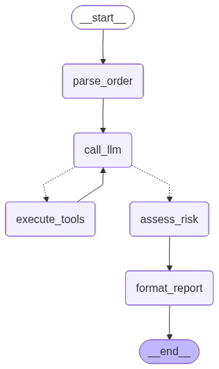

# Phase 4: The Infrastructure — What LangGraph Gives You Beyond a While Loop

## What This Phase Does

Phase 2 introduced the loop. Phase 3 made it intelligent — the LLM investigates selectively, Python scores deterministically. But both phases run blind. You can't see what the agent is doing while it runs. You can't stop it if it loops forever. You can't cap what it spends.

Phase 4 adds the infrastructure you need once the LLM controls the flow:

**Built into LangGraph (just use them):**
1. **Graph visualization** — `app.get_graph().draw_mermaid()` renders the graph as a diagram
2. **Streaming** — `app.stream(state, stream_mode="updates")` shows each node completing in real time
3. **Recursion limits** — `config={"recursion_limit": 25}` hard cap on graph steps

**Built into the graph (state + node changes):**
4. **Error handling** — tool errors become `Evidence` records instead of crashes
5. **Dead-end prevention** — `loop_count` in state, force-exit after N iterations
6. **Token budget circuit breaker** — `tokens_used` in state, stop before burning through your budget

## Architecture

```
START -> parse_order -> call_llm -> [should_continue]
                           ^         |-- has tool calls -> execute_tools -> call_llm (loop)
                           |         +-- done -> assess_risk -> format_report -> END
                           +-----------------------------------------+
```

Same graph as Phase 3. No new nodes, no new edges. The infrastructure lives inside existing nodes and in new state fields.

`graph.png` (generated by `app.get_graph().draw_mermaid_png()`) confirms the topology — the dotted lines from `call_llm` are conditional edges routing to either `execute_tools` (loop) or `assess_risk` (done).



## What's New Since Phase 3

The graph topology doesn't change. What changes is what happens *inside* nodes and what the state tracks.

### New State Fields

```python
class FraudStateV4(TypedDict):
    # --- carried from Phase 3 ---
    order: dict
    messages: Annotated[list, add_messages]
    evidence: Annotated[list[Evidence], operator.add]
    risk_score: int
    decision: str
    investigation_complete: bool
    # --- new in Phase 4 ---
    loop_count: int              # incremented each call_llm pass
    tokens_used: int             # cumulative token count
    guardrail_triggered: str     # "" | "dead_end" | "token_budget"
```

Three new fields, all counters. `loop_count` and `tokens_used` grow with each iteration. `guardrail_triggered` records why the investigation was cut short, if it was.

### How the Guardrails Work

**Dead-end prevention** — `call_llm` increments `loop_count` on every pass. `should_continue` checks it against `max_loops` from config. If the agent has looped too many times without calling `calculate_risk_score`, the graph forces it to `assess_risk` with whatever evidence exists. Partial evidence is scored rather than looping forever.

**Token budget** — the guardrail that matters most. An LLM call costs cents to dollars; a tool call (database query, API hit, local function) costs fractions of a cent or nothing. The cost difference is orders of magnitude. `call_llm` extracts token usage from `response.usage_metadata` after each API call and adds it to `tokens_used`. Before the *next* API call, it checks whether the budget is exceeded. If so, it sets `investigation_complete = True` and skips the call entirely. The graph routes to `assess_risk` and scores with available evidence.

**Recursion limit** — a circuit breaker to prevent runaway loops, the same problem any `while` loop has. Set it high (25, 50) so it never fires during normal operation. If the total number of graph steps exceeds `recursion_limit`, LangGraph raises `GraphRecursionError`. This is a different concern than the token budget — the token budget protects your money, the recursion limit prevents the graph from running forever.

### Why This Matters

Phase 2 explained that the loop transforms deterministic execution into dynamic execution — the LLM controls the flow. That's powerful but dangerous. Phase 4 is the answer to that danger:

- **Streaming** gives you visibility into what the agent is doing right now
- **Dead-end prevention** ensures the agent can't loop forever
- **Token budget** ensures the agent can't spend without limit
- **Error handling** ensures tool failures don't crash the investigation
- **Recursion limits** are the last-resort safety net

These aren't optional production niceties. If you're letting an LLM drive a loop, you need every one of them.

## Why Phase 4 Isn't in the Progressive Table

The progressive table tracks graph topology — nodes, edges, conditional edges. Phase 4 doesn't change any of them. Same 5 nodes, same loop, same conditional edge. The infrastructure lives inside existing nodes (counter increments, budget checks) and in new state fields. The graph shape is identical to Phase 3.

This is worth noting: not every meaningful change shows up in the graph topology. Phase 4 adds real substance — guardrails, visibility, cost control — without adding a single node or edge.

## Execution Traces

Streaming shows how different cases navigate the same graph. The compact traces collapse repeated `call_llm <-> execute_tools` cycles into loop counts:

```
Case 1: Obviously Legit
  parse_order -> [call_llm <-> execute_tools] x5 -> call_llm -> assess_risk -> format_report
  APPROVE (0) | 14 steps, 6 loops, 11,075 tokens

Case 2: Mildly Suspicious
  parse_order -> [call_llm <-> execute_tools] x6 -> call_llm -> assess_risk -> format_report
  APPROVE (33) | 16 steps, 7 loops, 13,468 tokens

Case 3: High Risk
  parse_order -> [call_llm <-> execute_tools] x6 -> call_llm -> assess_risk -> format_report
  REJECT (100) | 16 steps, 7 loops, 13,751 tokens

Case 4: Conflicting Signals
  parse_order -> [call_llm <-> execute_tools] x6 -> call_llm -> assess_risk -> format_report
  REVIEW (61) | 16 steps, 7 loops, 13,669 tokens

Case 5: Historical Fraud
  parse_order -> [call_llm <-> execute_tools] x6 -> call_llm -> assess_risk -> format_report
  APPROVE (10) | 16 steps, 7 loops, 13,416 tokens

Case 6: Tool Error
  parse_order -> [call_llm <-> execute_tools] x5 -> call_llm -> assess_risk -> format_report
  APPROVE (6) | 14 steps, 6 loops, 10,760 tokens
```

Cases 1 and 6 take 5 loop iterations; the rest take 6. The agent adapts — simpler cases exit faster. All scores match the Phase 3 baseline exactly.

## Guardrails in Action

### Dead-End Prevention (Case 3, max_loops=2)

```
Forced exit after 2 loops
Evidence collected: 1 items
Guardrail:  dead_end
Decision:   APPROVE (DEAD_END)
Score:      41/100
```

Case 3 normally scores 100 (REJECT) after 6 loops with 5 evidence items. With `max_loops=2`, the agent only collected 1 evidence item before being forced out. Score: 41 instead of 100. The decision is annotated with `(DEAD_END)` so downstream systems know it was cut short.

### Token Budget Circuit Breaker (Case 1, budget=1000)

```
Budget exhausted after 2 loops, 1,543 tokens
Guardrail:  token_budget
Decision:   APPROVE (TOKEN_BUDGET)
Score:      10/100
```

Case 1 normally scores 0 after 6 loops with 4 evidence items. With a 1,000-token budget, the first LLM call consumed 1,543 tokens (you can't stop mid-call), and the second call was skipped entirely. One evidence item, partial score, annotated with `(TOKEN_BUDGET)`.

### Error Handling (Case 6)

```
1. [ok] check_customer_history: low_risk (conf=0.80)
2. [??] check_payment_pattern: error (conf=0.50)  *** ERROR SIGNAL ***
3. [ok] verify_shipping_address: low_risk (conf=0.90)
4. [--] search_fraud_database: neutral (conf=0.70)
Decision: APPROVE (score: 6)
```

The payment service was unavailable. The error was recorded as evidence (risk_signal: `error`, confidence: 0.50) and the investigation continued with the remaining tools. The error contributes +2.5 points to the score instead of crashing the pipeline.

## LangSmith Tracing

For visual graph traces — nodes lighting up, state inspection at each step — see LangGraph Studio (desktop) or LangSmith (cloud). They consume the same stream events and render them as interactive diagrams.

`reject-order.png` shows a LangSmith trace of a Case 3 (High Risk) investigation, with each node's input/output inspectable.


## Results

| Case | Decision | Score | Steps | Loops | Tokens |
|------|----------|-------|-------|-------|--------|
| 1: Obviously Legit | APPROVE | 0 | 14 | 6 | 11,075 |
| 2: Mildly Suspicious | APPROVE | 33 | 16 | 7 | 13,468 |
| 3: High Risk | REJECT | 100 | 16 | 7 | 13,751 |
| 4: Conflicting Signals | REVIEW | 61 | 16 | 7 | 13,669 |
| 5: Historical Fraud | APPROVE | 10 | 16 | 7 | 13,416 |
| 6: Tool Error | APPROVE | 6 | 14 | 6 | 10,760 |

All decisions and scores match the Phase 3 baseline. The guardrail demos intentionally trigger early exits with different scores from partial evidence — that's the point. Partial results are better than infinite loops or runaway costs.

## How to Run

```bash
python3 phases/phase4-infrastructure/graph.py
```
