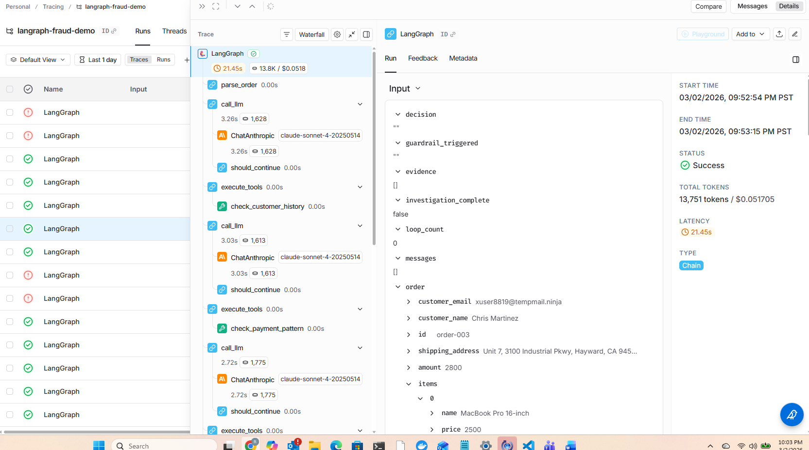

# Phase 4: The Infrastructure — Results

## The Problem

LLM calls are expensive and non-deterministic. In a ReAct agent, **the LLM controls the loop** — after every `call_llm`, the model decides whether to call another tool or stop. You can't guarantee it will stop on its own.

Ways the LLM can send the graph into an endless loop:
- **Repeating tool calls.** The prompt says "don't call the same tool twice with the same inputs," but that's a suggestion to the model, not an enforcement. It can call `check_customer_history` over and over, getting the same result each time.
- **Indecision from conflicting signals.** Case 4 (Robert Chen) has low-risk customer history but a high-risk warehouse address. A model could keep cross-referencing — searching the fraud database for the email, then the address, then the name, then the email again — never feeling confident enough to finalize.
- **Hallucinating tools.** If the model calls `check_ip_address` (doesn't exist), `execute_tools` returns an error. The model sees the error and tries again with a different made-up name. Loop.
- **Never finalizing.** The model could decide it "needs more evidence" indefinitely, never calling `calculate_risk_score`. Without that call, `investigation_complete` never becomes `True` and the loop continues.

Each loop iteration costs real money — our cases use ~2,000 tokens per round. An unconstrained loop could burn through thousands of dollars before anyone notices.

## What LangGraph Provides

Phase 4 demonstrates six infrastructure features that address this. They split into two categories:

**Observability** — see what the graph is doing:
1. Graph visualization — see the static structure
2. Streaming — watch the actual execution path in real time

**Cost and runaway protection** — prevent the LLM from looping forever:
3. Recursion limit — hard step cap built into the framework (emergency brake, raises exception)
4. Error handling — structured evidence keeps the agent running when tools fail
5. Dead-end prevention (`max_loops`) — graceful exit with scoring on partial evidence
6. Token budget — caps the dollar cost directly

Features 3, 5, and 6 are three layers of defense against the same problem:

| Layer | What it counts | What happens when triggered | When it fires |
|---|---|---|---|
| `max_loops=10` | `call_llm` invocations | Graceful exit: scores partial evidence, annotates decision | First line of defense |
| `token_budget=100,000` | Cumulative tokens | Graceful exit: skips API call, scores partial evidence | Caps dollar cost |
| `recursion_limit=25` | Every node execution | Hard crash: `GraphRecursionError` exception, no result | Emergency brake |

In normal operation, none of these fire. They exist for when the LLM misbehaves.

## Architecture

Same graph shape as Phase 3. No new nodes, no new tools. The infrastructure lives inside existing nodes and the runner.

```
START -> parse_order -> call_llm -> [should_continue]
                                     |-- has tool calls -> execute_tools -> call_llm (loop)
                                     |-- dead_end (loop_count >= max_loops) -> assess_risk
                                     +-- done -> assess_risk -> format_report -> END
```

State extends Phase 3 with three new fields: `loop_count`, `tokens_used`, `guardrail_triggered`.

---

## Feature 1: Graph Visualization

**LangGraph API:** `app.get_graph().draw_mermaid()` / `app.get_graph().draw_mermaid_png()`

Every compiled graph can render itself. No instrumentation, no manual diagramming — the graph structure *is* the diagram.

**Code:**
```python
app = build_graph()
mermaid_text = app.get_graph().draw_mermaid()
print(mermaid_text)
```

**Output:**
```
graph TD;
    __start__ --> parse_order;
    assess_risk --> format_report;
    call_llm -.-> assess_risk;
    call_llm -.-> execute_tools;
    execute_tools --> call_llm;
    parse_order --> call_llm;
    format_report --> __end__;
```

Paste this into any Mermaid renderer (GitHub markdown, mermaid.live, VS Code preview) and you get the visual graph. The `-.->` dashed arrows are conditional edges (from `should_continue`), the `-->` solid arrows are fixed edges. `draw_mermaid_png()` renders directly to a PNG file — saved as `graph.png` alongside the script.

**Important caveat:** This diagram is the **static** graph structure — identical for every case. It shows that `call_llm` *can* route to `execute_tools` or `assess_risk`, but not how many times a specific case actually loops. For what the graph *actually did* on a given input, you need streaming (Feature 2).

---

## Feature 2: Streaming

**LangGraph API:** `app.stream(state, stream_mode="updates")`

`app.stream()` **is** the execution — it runs the graph and yields events as each node completes. This is not a separate observation layer bolted on; it replaces `app.invoke()` as the way you run the graph. With `stream_mode="updates"`, each event tells you which node just ran and exactly which state keys it changed.

Demo 2 streams all 6 cases. This is where you see how different inputs take different paths through the same static graph.

**Code:**
```python
for event in app.stream(initial_state, config=config, stream_mode="updates"):
    node_name = list(event.keys())[0]
    updates = event[node_name]
    if updates:
        print(f"[{node_name}] {list(updates.keys())}")
    else:
        print(f"[{node_name}] (no state changes)")
```

**Output (Case 1 — Obviously Legit, 14 steps):**
```
[parse_order] (no state changes)
[call_llm] ['messages', 'loop_count', 'tokens_used']
[execute_tools] ['messages', 'evidence']
[call_llm] ['messages', 'loop_count', 'tokens_used']
[execute_tools] ['messages', 'evidence']
[call_llm] ['messages', 'loop_count', 'tokens_used']
[execute_tools] ['messages', 'evidence']
[call_llm] ['messages', 'loop_count', 'tokens_used']
[execute_tools] ['messages', 'evidence']
[call_llm] ['messages', 'loop_count', 'tokens_used']
[execute_tools] ['messages', 'evidence', 'risk_score', 'decision', 'investigation_complete']
[call_llm] ['messages', 'loop_count', 'tokens_used']
[assess_risk] (no state changes)

==================================================
INVESTIGATION REPORT — Order order-001
==================================================
Customer: Alice Johnson (alice.johnson@gmail.com)
Amount:   $45.00
Decision: APPROVE
Score:    0/100
Evidence: 4 items collected
  1. [ok] check_customer_history: Customer history: 50 prior orders, risk_level=low
     Signal: low_risk | Confidence: 0.95
  2. [ok] check_payment_pattern: Payment pattern: anomaly=False, velocity=normal
     Signal: low_risk | Confidence: 0.85
  3. [ok] verify_shipping_address: Address type: residential, geo_risk=low
     Signal: low_risk | Confidence: 0.90
  4. [- ] search_fraud_database: No fraud records found for this indicator
     Signal: neutral | Confidence: 0.70
--- Infrastructure ---
Loops:  6
Tokens: 11,075
==================================================

[format_report] (no state changes)
Trace: parse_order -> [call_llm <-> execute_tools] x5 -> call_llm -> assess_risk -> format_report
-> APPROVE (score: 0) | 14 steps, 6 loops, 11,075 tokens
```

**Output (Case 3 — High Risk, 16 steps):**
```
[parse_order] (no state changes)
[call_llm] ['messages', 'loop_count', 'tokens_used']
[execute_tools] ['messages', 'evidence']
... (6 rounds of call_llm <-> execute_tools)
[execute_tools] ['messages', 'evidence', 'risk_score', 'decision', 'investigation_complete']
[call_llm] ['messages', 'loop_count', 'tokens_used']
[assess_risk] (no state changes)

==================================================
INVESTIGATION REPORT — Order order-003
==================================================
Customer: Chris Martinez (xuser8819@tempmail.ninja)
Amount:   $2800.00
Decision: REJECT
Score:    100/100
Evidence: 5 items collected
  1. [!!] check_customer_history: Customer history: 0 prior orders, risk_level=high.
     Disposable email provider detected
     Signal: high_risk | Confidence: 0.70
  2. [! ] check_payment_pattern: Payment pattern: anomaly=unknown, velocity=first_order
     Signal: medium_risk | Confidence: 0.50
  3. [!!] verify_shipping_address: Address type: warehouse/freight_forwarder, geo_risk=high.
     Known freight forwarding facility
     Signal: high_risk | Confidence: 0.95
  4. [!!] search_fraud_database: Fraud DB: 14 matches found.
     Disposable email provider frequently used in fraud
     Signal: high_risk | Confidence: 0.86
  5. [- ] search_fraud_database: No fraud records found for this indicator
     Signal: neutral | Confidence: 0.70
--- Infrastructure ---
Loops:  7
Tokens: 13,751
==================================================

[format_report] (no state changes)
Trace: parse_order -> [call_llm <-> execute_tools] x6 -> call_llm -> assess_risk -> format_report
-> REJECT (score: 100) | 16 steps, 7 loops, 13,751 tokens
```

**What this reveals across all 6 cases:**
- Cases 1 & 6 take **14 steps** (5 tool-calling rounds). Case 1 is simple/low-risk, Case 6 gets a tool error and has one fewer result to reason about.
- Cases 2-5 take **16 steps** (6 tool-calling rounds). More complex cases trigger additional cross-referencing.
- The `execute_tools` event only includes `risk_score, decision, investigation_complete` on the **final** round — that's when `calculate_risk_score` fires.
- `assess_risk` and `format_report` return no state changes because the investigation completed normally via `calculate_risk_score`.

**Visual graph traces:** The console output above is the raw event stream. For interactive visualizations (nodes lighting up, state inspection, timeline views), LangGraph Studio (desktop app) and LangSmith (cloud tracing) consume these same stream events and render them graphically. Set your `LANGCHAIN_API_KEY` in `.env` to enable LangSmith — traces appear automatically at smith.langchain.com.

Below is a LangSmith trace for Case 3 (High Risk — REJECT). The left panel shows the execution tree (each node invocation), and the right panel shows the state at that point — including `risk_score`, `tokens_used`, `evidence`, and `guardrail_triggered`:



---

## Feature 3: Recursion Limit (Emergency Brake)

**LangGraph API:** `config={"recursion_limit": N}`

Despite the name, this is a **step counter**, not true recursion. LangGraph counts total node executions. If the count exceeds the limit, it raises `GraphRecursionError` — a hard crash, not a graceful exit. LangGraph calls it "recursion" because the graph loop (call_llm -> execute_tools -> call_llm -> ...) is implemented internally via recursive traversal, but from the user's perspective it's "max total steps."

**The math for our graph:**
```
Total steps = 1 (parse_order)
            + 2 x N (call_llm + execute_tools per round)
            + 1 (final call_llm after scoring)
            + 1 (assess_risk)
            + 1 (format_report)
            = 2N + 4
```

Our cases use 5-6 rounds = 14-16 steps. With 20 tools each called once, that's 44 steps. A `recursion_limit=25` would crash at round 12, killing the investigation with no result.

**Code:**
```python
from langgraph.errors import GraphRecursionError

try:
    app.invoke(initial_state, config={"recursion_limit": 3})
except GraphRecursionError as e:
    print(f"Caught: {e}")
```

**Output (Case 3 — High Risk, with recursion_limit=3):**
```
[parse_order] Order order-003: $2800.00, 2 items...

Caught GraphRecursionError (as expected):
  Recursion limit of 3 reached without hitting a stop condition. You can increase
  the limit by setting the `recursion_limit` config key.
```

With `recursion_limit=3`: `parse_order` (1) -> `call_llm` (2) -> `execute_tools` (3) -> CRASH. The graph can't even complete one investigation round.

**Role in the defense layers:** This is the emergency brake. It exists for the case where a bug in your node code causes infinite execution that bypasses the application-level checks (`max_loops`, `token_budget`). In practice, those should always trigger first. `recursion_limit` is the "something went wrong that we didn't anticipate" backstop.

---

## Feature 4: Error Handling

**LangGraph feature:** Structured state + evidence accumulation

When a tool fails, the error is recorded as structured evidence with `risk_signal="error"` and `confidence=0.5`, and the agent continues investigating with other tools. Without this, a single tool failure could crash the entire investigation or — worse — send the LLM into a retry loop.

**Output (Case 6 — Tool Error):**
```
==================================================
INVESTIGATION REPORT — Order order-006
==================================================
Customer: Sam Taylor (sam.taylor@gmail.com)
Amount:   $150.00
Decision: APPROVE
Score:    6/100
Evidence: 4 items collected
  1. [ok] check_customer_history: Customer history: 5 prior orders, risk_level=low
     Signal: low_risk | Confidence: 0.80
  2. [??] check_payment_pattern: Tool error: Payment processing service unavailable
     Signal: error | Confidence: 0.50
  3. [ok] verify_shipping_address: Address type: residential, geo_risk=low
     Signal: low_risk | Confidence: 0.90
  4. [- ] search_fraud_database: No fraud records found for this indicator
     Signal: neutral | Confidence: 0.70
--- Infrastructure ---
Loops:  6
Tokens: 10,760
==================================================

Evidence trail showing error handling:
  1. check_customer_history: low_risk (conf=0.80)
  2. check_payment_pattern:  error   (conf=0.50) *** ERROR SIGNAL ***
     Finding: Tool error: Payment processing service unavailable
     The system continued investigating despite this error.
  3. verify_shipping_address: low_risk (conf=0.90)
  4. search_fraud_database:  neutral  (conf=0.70)

Final decision: APPROVE (score: 6)
The error was recorded as evidence but did not block the investigation.
```

The `[??]` marker in the report flags the error visually. The scoring formula gives errors a small positive weight (+5 * 0.5 = +2.5) — enough to nudge the score up slightly but not enough to change the decision. Three clean low-risk signals outweigh one error. The error is auditable — you can trace exactly how it affected the score.

---

## Feature 5: Dead-End Prevention (`max_loops`)

**LangGraph feature:** State field `loop_count` + routing check in `should_continue`

This is the primary defense against runaway loops. The `call_llm` node increments `loop_count` on every pass. The `should_continue` router checks if it's hit the limit. If so, it routes to `assess_risk` which scores with whatever partial evidence exists — a graceful exit, not a crash.

**Code (in `should_continue`):**
```python
max_loops = config.get("configurable", {}).get("max_loops", 10)
if state.get("loop_count", 0) >= max_loops:
    return "assess_risk"  # force exit
```

**Output (Case 3 — High Risk, with max_loops=2):**
```
[should_continue] Dead-end prevention: 2/2 loops — forcing exit
[assess_risk] Guardrail: dead_end — scoring on 1 evidence items

INVESTIGATION REPORT — Order order-003
==================================================
Customer: Chris Martinez (xuser8819@tempmail.ninja)
Amount:   $2800.00
Decision: APPROVE (DEAD_END)
Score:    41/100
Evidence: 1 items collected
Guardrail: dead_end
  1. [!!] check_customer_history: Customer history: 0 prior orders, risk_level=high.
     Disposable email provider detected
     Signal: high_risk | Confidence: 0.70
--- Infrastructure ---
Loops:  2
Tokens: 3,241
```

With only 2 loops, the agent collected 1 of the normal 5 evidence items. The score (41) is based on that single high-risk signal, but without the additional evidence from address verification and fraud database, it doesn't cross the reject threshold (80). The decision is annotated `APPROVE (DEAD_END)` so a reviewer knows it was cut short.

**Compare with the full investigation:** Same case scores REJECT (100) with 5 evidence items and 7 loops. The dead-end prevention trades completeness for bounded execution — you get a result with an explanation instead of an infinite loop or a crash.

---

## Feature 6: Token Budget Circuit Breaker

**LangGraph feature:** State field `tokens_used` + budget check in `call_llm`

This caps the dollar cost directly. Before every LLM API call, `call_llm` checks if accumulated tokens exceed the budget. If so, it skips the API call entirely and routes to scoring. This catches the case where `max_loops` is set generously but each call is expensive (large context windows, verbose models).

**Code (in `call_llm`):**
```python
if tokens_used >= token_budget:
    return {
        "loop_count": loop_count,
        "guardrail_triggered": "token_budget",
        "investigation_complete": True,
    }
```

Token tracking uses `response.usage_metadata` from langchain-anthropic:
```python
if hasattr(response, "usage_metadata") and response.usage_metadata:
    meta = response.usage_metadata
    new_tokens = meta.get("input_tokens", 0) + meta.get("output_tokens", 0)
```

**Output (Case 1 — Obviously Legit, with token_budget=1000):**
```
[call_llm] Token budget exceeded (1,543/1,000) at loop 2 — forcing exit
[assess_risk] Guardrail: token_budget — scoring on 1 evidence items

INVESTIGATION REPORT — Order order-001
==================================================
Customer: Alice Johnson (alice.johnson@gmail.com)
Amount:   $45.00
Decision: APPROVE (TOKEN_BUDGET)
Score:    10/100
Evidence: 1 items collected
Guardrail: token_budget
  1. [ok] check_customer_history: Customer history: 50 prior orders, risk_level=low
     Signal: low_risk | Confidence: 0.95
--- Infrastructure ---
Loops:  2
Tokens: 1,543
```

The first LLM call consumed 1,543 tokens. When `call_llm` runs for loop 2, it checks: 1,543 >= 1,000? Yes — budget exceeded. The API call is skipped, and the graph scores on the single evidence item. Same case normally uses 11,075 tokens across 6 loops.

---

## Full Run — All 6 Cases

All 6 cases streamed via `app.stream(state, stream_mode="updates")` with normal settings (no artificial limits).

**Case 1: Obviously Legit** — see Feature 2 output above.

**Case 2: Mildly Suspicious:**
```
==================================================
INVESTIGATION REPORT — Order order-002
==================================================
Customer: Jordan Smith (newbuyer_2026@outlook.com)
Amount:   $380.00
Decision: APPROVE
Score:    33/100
Evidence: 5 items collected
  1. [! ] check_customer_history: Customer history: 0 prior orders, risk_level=medium.
     New account, no purchase history
     Signal: medium_risk | Confidence: 0.70
  2. [! ] check_payment_pattern: Payment pattern: anomaly=unknown, velocity=first_order.
     No purchase history to compare
     Signal: medium_risk | Confidence: 0.50
  3. [ok] verify_shipping_address: Address type: apartment, geo_risk=low
     Signal: low_risk | Confidence: 0.50
  4. [- ] search_fraud_database: No fraud records found for this indicator
     Signal: neutral | Confidence: 0.70
  5. [- ] search_fraud_database: No fraud records found for this indicator
     Signal: neutral | Confidence: 0.70
--- Infrastructure ---
Loops:  7
Tokens: 13,468
==================================================
```

**Case 3: High Risk** — see Feature 2 output above.

**Case 4: Conflicting Signals:**
```
==================================================
INVESTIGATION REPORT — Order order-004
==================================================
Customer: Robert Chen (robert.chen@company.com)
Amount:   $1500.00
Decision: REVIEW
Score:    61/100
Evidence: 5 items collected
  1. [ok] check_customer_history: Customer history: 30 prior orders, risk_level=low
     Signal: low_risk | Confidence: 0.95
  2. [! ] check_payment_pattern: Payment pattern: anomaly=True, velocity=normal.
     Amount is 1.9x above typical maximum
     Signal: medium_risk | Confidence: 0.80
  3. [!!] verify_shipping_address: Address type: warehouse, geo_risk=high.
     Address shared by 3 accounts this week
     Signal: high_risk | Confidence: 0.95
  4. [- ] search_fraud_database: No fraud records found for this indicator
     Signal: neutral | Confidence: 0.70
  5. [- ] search_fraud_database: No fraud records found for this indicator
     Signal: neutral | Confidence: 0.70
--- Infrastructure ---
Loops:  7
Tokens: 13,669
==================================================
```

**Case 5: Historical Fraud:**
```
==================================================
INVESTIGATION REPORT — Order order-005
==================================================
Customer: Pat Williams (pat.williams@yahoo.com)
Amount:   $60.00
Decision: APPROVE
Score:    10/100
Evidence: 5 items collected
  1. [! ] check_customer_history: Customer history: 8 prior orders, risk_level=medium.
     Previous fraud flag 6 months ago
     Signal: medium_risk | Confidence: 0.80
  2. [ok] check_payment_pattern: Payment pattern: anomaly=False, velocity=normal
     Signal: low_risk | Confidence: 0.85
  3. [ok] verify_shipping_address: Address type: residential, geo_risk=low
     Signal: low_risk | Confidence: 0.90
  4. [ok] search_fraud_database: Fraud DB: 1 matches found.
     Prior flag resolved as false_positive
     Signal: low_risk | Confidence: 0.50
  5. [- ] search_fraud_database: No fraud records found for this indicator
     Signal: neutral | Confidence: 0.70
--- Infrastructure ---
Loops:  7
Tokens: 13,416
==================================================
```

**Case 6: Tool Error** — see Feature 4 output above.

### Execution Traces

The Mermaid diagram (Feature 1) is the same for every case. The execution traces show what actually happens — how different inputs navigate that same graph differently. Repeated `call_llm <-> execute_tools` cycles are collapsed with a count.

```
Case 1: Obviously Legit
  parse_order -> [call_llm <-> execute_tools] x5 -> call_llm -> assess_risk -> format_report
  APPROVE (0) | 14 steps, 6 loops, 11,075 tokens

Case 2: Mildly Suspicious
  parse_order -> [call_llm <-> execute_tools] x6 -> call_llm -> assess_risk -> format_report
  APPROVE (33) | 16 steps, 7 loops, 13,468 tokens

Case 3: High Risk
  parse_order -> [call_llm <-> execute_tools] x6 -> call_llm -> assess_risk -> format_report
  REJECT (100) | 16 steps, 7 loops, 13,751 tokens

Case 4: Conflicting Signals
  parse_order -> [call_llm <-> execute_tools] x6 -> call_llm -> assess_risk -> format_report
  REVIEW (61) | 16 steps, 7 loops, 13,669 tokens

Case 5: Historical Fraud
  parse_order -> [call_llm <-> execute_tools] x6 -> call_llm -> assess_risk -> format_report
  APPROVE (10) | 16 steps, 7 loops, 13,416 tokens

Case 6: Tool Error
  parse_order -> [call_llm <-> execute_tools] x5 -> call_llm -> assess_risk -> format_report
  APPROVE (6) | 14 steps, 6 loops, 10,760 tokens
```

**What the traces show:**

- **Cases 1 and 6 loop 5 times; Cases 2-5 loop 6 times.** The simple/error cases finish with fewer tool calls. Case 1 (established customer, low amount) doesn't trigger extra cross-referencing. Case 6 gets a payment tool error, so it has one fewer tool result to reason about.

- **Cases 2-5 all loop 6 times** despite very different risk profiles (APPROVE 33 vs REJECT 100). The LLM tends to be thorough — it calls most tools regardless. The difference in outcomes comes from what the tools *return*, not how many times the graph loops.

- **Every case ends with `call_llm -> assess_risk`** — the final `call_llm` is where the LLM sees the `calculate_risk_score` result and stops requesting tools. `assess_risk` finds `investigation_complete=True` and passes through.

- **Contrast with the guardrail demos:** Demo 5 (dead-end, `max_loops=2`) forced exit after a single tool call — 5 steps instead of 16. Demo 6 (token budget) forced exit on the second `call_llm` — 1,543 tokens instead of 13,751. The guardrails cut the execution short while still producing a scored result.

## Results Summary

```
Case                           Decision     Score Steps Loops   Tokens
──────────────────────────────────────────────────────────────────────────
Case 1: Obviously Legit        APPROVE          0    14     6   11,075
Case 2: Mildly Suspicious      APPROVE         33    16     7   13,468
Case 3: High Risk              REJECT         100    16     7   13,751
Case 4: Conflicting Signals    REVIEW          61    16     7   13,669
Case 5: Historical Fraud       APPROVE         10    16     7   13,416
Case 6: Tool Error             APPROVE          6    14     6   10,760
```

Steps = total node executions (what `recursion_limit` counts). Loops = `call_llm` invocations (what `max_loops` counts).

No guardrails triggered. The infrastructure is invisible when limits aren't hit — same decisions, same scores as Phase 3.

## Phase 3 vs Phase 4 Comparison

| Case | Phase 3 | Phase 4 | Match? |
|---|---|---|:---:|
| 1: Obviously Legit | APPROVE (0) | APPROVE (0) | Yes |
| 2: Mildly Suspicious | APPROVE (33) | APPROVE (33) | Yes |
| 3: High Risk | REJECT (100) | REJECT (100) | Yes |
| 4: Conflicting Signals | REVIEW (61) | REVIEW (61) | Yes |
| 5: Historical Fraud | APPROVE (10) | APPROVE (10) | Yes |
| 6: Tool Error | APPROVE (6) | APPROVE (6) | Yes |

All 6 cases produce identical decisions and scores. Phase 4 adds infrastructure without changing investigation behavior.

## Configuration

```python
DEFAULT_CONFIG = {
    "max_loops": 10,       # primary defense — graceful exit after N LLM calls
    "token_budget": 100_000, # cost cap — graceful exit when budget exceeded
    "recursion_limit": 25,   # emergency brake — hard crash after N total steps
}
```

Passed via LangGraph's `RunnableConfig` mechanism. At invocation:

```python
config = {
    "recursion_limit": 25,                          # top-level (LangGraph built-in)
    "configurable": {"max_loops": 10, "token_budget": 100_000},  # custom (nodes read these)
}
app.invoke(state, config=config)
```

Nodes access custom limits through `config.get("configurable", {})`. The runner overrides these for specific demos (e.g., `max_loops=2`, `token_budget=1000`) without changing any graph code. A production system could give different budgets to different order tiers.

## Comparison Across All Phases

| Case | Phase 1 | Phase 2 | Phase 3 | Phase 4 |
|---|---|---|---|---|
| 1: Obviously Legit | APPROVE (5) | APPROVE (15) | APPROVE (0) | APPROVE (0) |
| 2: Mildly Suspicious | REVIEW (75) | REVIEW (45) | APPROVE (33) | APPROVE (33) |
| 3: High Risk | REJECT (85) | REJECT (95) | REJECT (100) | REJECT (100) |
| 4: Conflicting Signals | APPROVE (5) | REVIEW (75) | REVIEW (61) | REVIEW (61) |
| 5: Historical Fraud | APPROVE (25) | REVIEW (35) | APPROVE (10) | APPROVE (10) |
| 6: Tool Error | APPROVE (15) | APPROVE (25) | APPROVE (6) | APPROVE (6) |

## Observations

- **LLM calls are expensive and the LLM controls the loop.** This is the fundamental risk of any ReAct agent. The model's non-deterministic behavior means you can't guarantee it will stop. Features 3, 5, and 6 are three layers of defense — `max_loops` for graceful control, `token_budget` for cost capping, `recursion_limit` as the emergency brake.

- **The guardrails degrade gracefully.** When `max_loops` or `token_budget` fires, the system doesn't crash — it scores with whatever evidence it has. The result may be less accurate (Case 3 scored 41 instead of 100 with only 1 evidence item), but it's always a valid, explainable decision. Only `recursion_limit` crashes, and that should never fire in normal operation.

- **Guardrail annotations in decisions** (e.g., `"APPROVE (DEAD_END)"`, `"APPROVE (TOKEN_BUDGET)"`) make it immediately clear when a result was influenced by infrastructure limits rather than a complete investigation. A human reviewer seeing `(DEAD_END)` knows to investigate further.

- **Observability is free.** `draw_mermaid()` and `stream()` require zero changes to the graph — just use a different method on the compiled app. Streaming is particularly powerful because it *is* the execution, not an add-on. LangGraph Studio and LangSmith render the same events as interactive visual traces.

- **Token tracking uses `response.usage_metadata`** exposed by langchain-anthropic on AIMessage. Each `call_llm` invocation extracts `input_tokens + output_tokens` and accumulates into `tokens_used`. Typical investigation costs 10,000-14,000 tokens across 6-7 LLM calls.

- **Configuration via `RunnableConfig`** keeps limits out of the state schema and lets the runner override per-invocation. The same graph runs with different limits without code changes.
